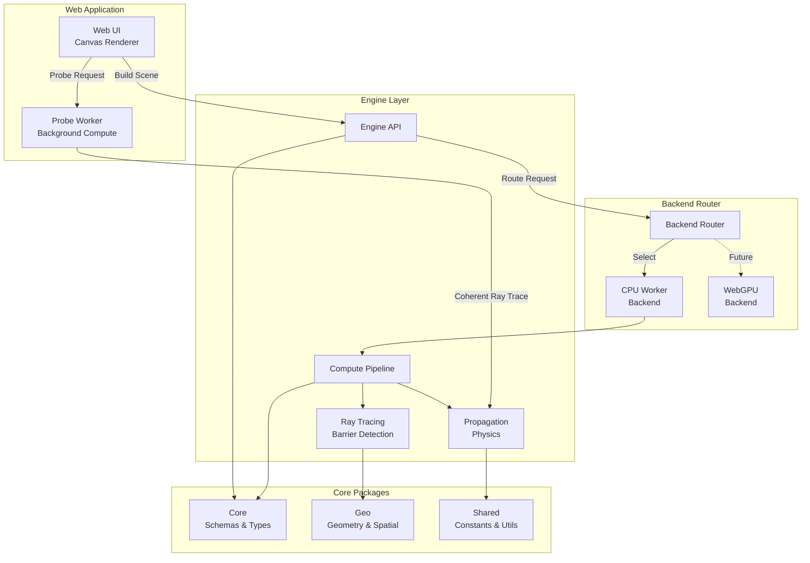
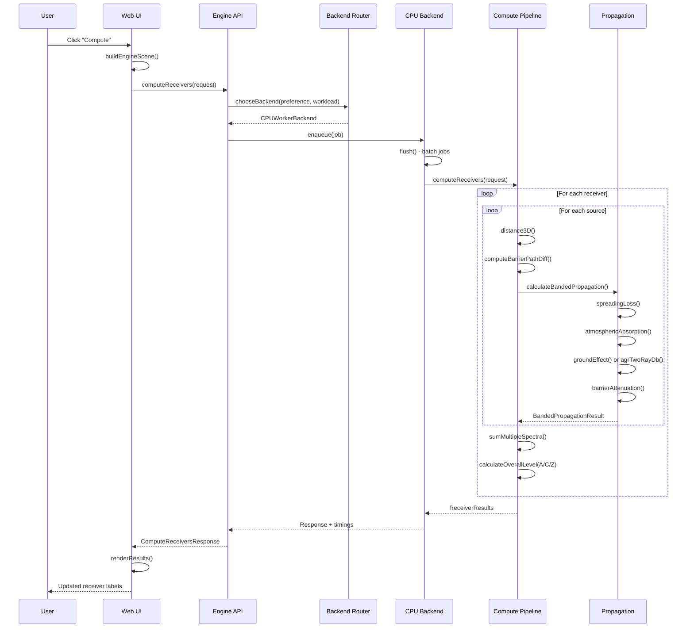
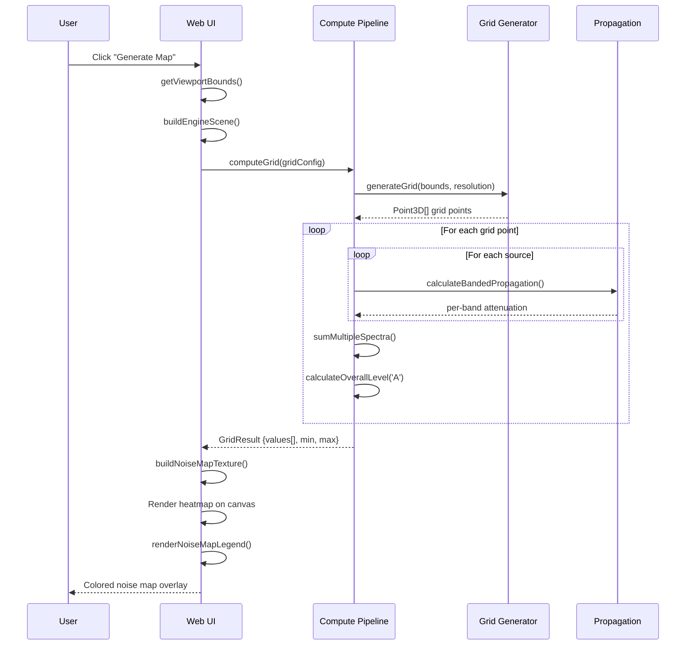
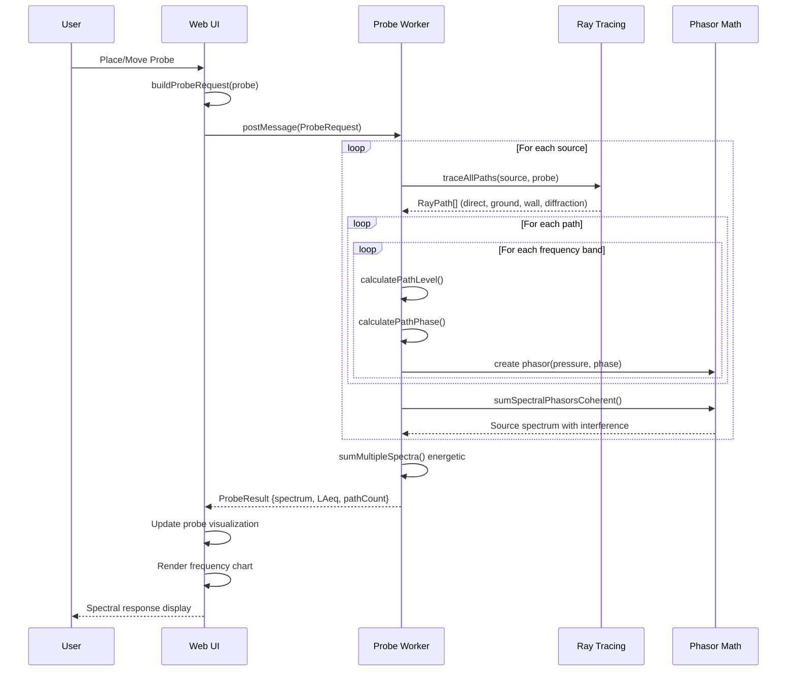
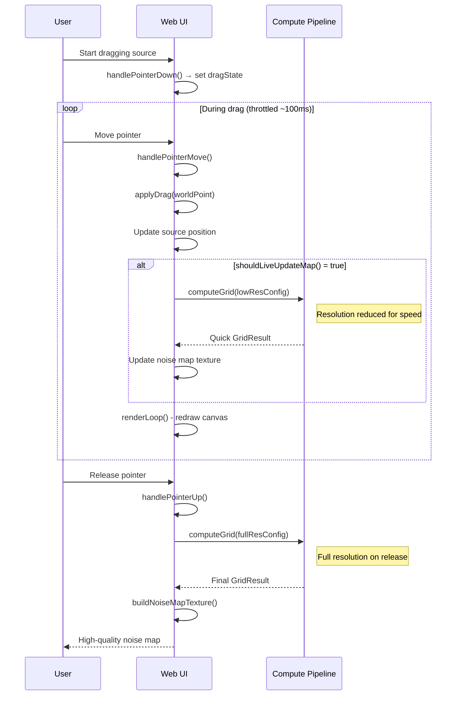
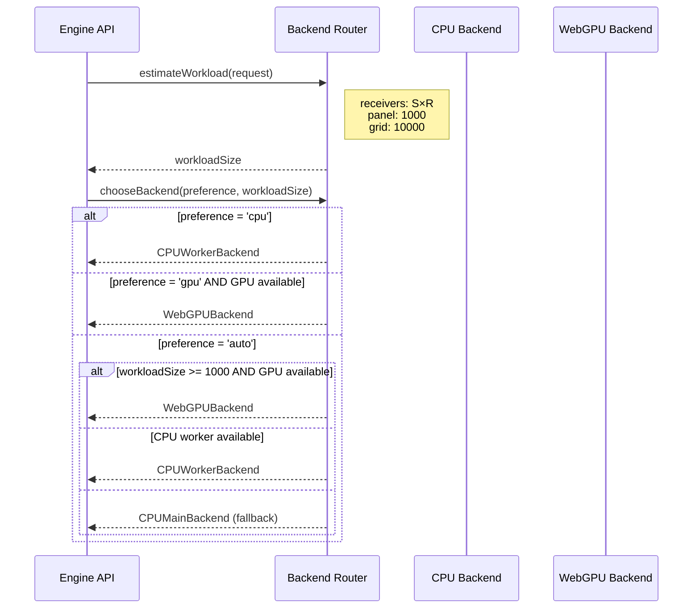

# GeoNoise - Architecture & Developer Guide

> **Interactive Sound Propagation Sandbox for Acoustic Site Planning**

## 1. Overview

### Purpose

GeoNoise is an interactive noise propagation sandbox designed for rapid acoustic site planning and "what-if" exploration. It enables users to place sound sources, receivers, barriers, and buildings on a canvas, then compute receiver levels, panel statistics, and full-scene noise maps in seconds.

### Key Features

- **Interactive Canvas**: Place and drag sources, receivers, barriers, and buildings with live updates
- **9-Band Spectral Engine**: Full octave band analysis (63 Hz – 16 kHz) with A/C/Z weighting
- **Propagation Physics**: Spherical/cylindrical spreading, ISO 9613 atmospheric absorption, ground reflection, and barrier diffraction
- **Noise Map Visualization**: Real-time heatmap generation with adaptive resolution during interaction
- **Panel Statistics**: Min/max/avg/p95/L90 calculations for defined listening areas
- **Coherent Phasor Summation**: Accurate interference modeling for ground reflections and multi-path propagation
- **CPU/WebGPU Backend Selection**: Intelligent backend routing based on workload size

### Technologies

| Layer | Technologies |
|-------|-------------|
| **Language** | TypeScript 5.3 |
| **Build System** | Turbo (monorepo), tsc |
| **Runtime** | Browser (Web Workers, WebGPU) |
| **Validation** | Zod schema validation |
| **Testing** | Vitest |
| **Rendering** | Canvas 2D API |
| **Math** | Complex phasor arithmetic, ISO 9613-1/2 |

---

## 2. Monorepo Structure

```
GeoNoise/
├── apps/
│   └── web/                    # Web application
│       ├── src/
│       │   ├── main.ts         # Entry point (5k+ lines, orchestrates everything)
│       │   ├── probeWorker.ts  # Background compute
│       │   └── ...
│       └── scripts/            # Build scripts
├── packages/
│   ├── core/                   # Schemas (Zod), units, coordinate transforms, scene migration
│   ├── engine/                 # Reference CPU propagation model (the physics)
│   ├── engine-backends/        # Backend router (CPU-worker vs WebGPU), engineCompute() entrypoint
│   ├── engine-webgpu/          # WebGPU backend stub (not yet implemented)
│   ├── geo/                    # Geometry kernel, spatial grid generation
│   └── shared/                 # Constants, branded types, math utilities
├── docs/                       # Documentation
├── package.json                # Monorepo root
└── turbo.json                  # Turbo build config
```

### Package Dependencies

- Packages import via `@geonoise/<pkg>` aliases (configured in `tsconfig.base.json` paths)
- Dependency graph: `shared → core → geo/engine → engine-backends → web`
- Never import from `dist/`; use source paths for development

---

## 3. High-Level Architecture Diagram



### Component Overview

| Component | Description |
|-----------|-------------|
| **Web UI** | Canvas-based editor with real-time rendering, interaction handling, and noise map visualization |
| **Probe Worker** | Background Web Worker for coherent ray-traced probe calculations with phase summation |
| **Engine API** | Request/response interface defining compute operations for receivers, panels, and grids |
| **Compute Pipeline** | Orchestrates per-receiver, per-source propagation calculations with spectral processing |
| **Propagation Physics** | ISO 9613-based models for spreading, absorption, ground effects, and barrier attenuation |
| **Ray Tracing** | 2.5D barrier occlusion detection and path difference calculation for diffraction |
| **Backend Router** | Selects CPU or GPU backend based on workload size and user preference |
| **Core Schemas** | Zod-validated domain models for sources, receivers, panels, obstacles, and scenes |
| **Geo Package** | Geometry primitives, spatial indexing, and map coordinate transformations |
| **Shared Utils** | Physical constants, phasor math, spectral operations, and common utilities |

---

## 4. Data Flow

1. UI creates scene objects matching `@geonoise/core` schemas
2. UI calls `engineCompute(request, preference)` from `@geonoise/engine-backends`
3. `BackendRouter` selects backend based on preference (`'auto' | 'cpu' | 'gpu'`) and workload size
4. Backend delegates to `CPUEngine` which applies propagation physics
5. Response contains `ReceiverResult[]`, `PanelResult`, or `GridResult` with timings/warnings

### Key Types and Interfaces

- **Scene**: Validated via `SceneSchema` in [packages/core/src/schema/index.ts](../packages/core/src/schema/index.ts)
- **ComputeRequest/Response**: Union types for `'receivers' | 'panel' | 'grid'` in [packages/engine/src/api/index.ts](../packages/engine/src/api/index.ts)
- **PropagationResult**: Per-path attenuation breakdown in [packages/engine/src/propagation/index.ts](../packages/engine/src/propagation/index.ts)

---

## 5. Component Breakdown

### Component: Web Application (`apps/web`)

**Entry Point**: [main.ts](../apps/web/src/main.ts)

**Purpose**: Browser-based interactive canvas editor for acoustic scene modeling and visualization.

**Key Elements**:
- [`init()`](../apps/web/src/main.ts#L5647) - Main initialization function wiring all UI components
- [`renderLoop()`](../apps/web/src/main.ts#L4549) - Canvas rendering pipeline with layer-based drawing
- [`buildEngineScene()`](../apps/web/src/main.ts#L1394) - Converts UI primitives to engine schema format
- [`computeScene()`](../apps/web/src/main.ts#L1888) - Orchestrates computation with selected backend
- [`handlePointerDown/Move/Up()`](../apps/web/src/main.ts#L4778) - Canvas interaction event handlers

**Depends On**:
- Internal: `@geonoise/engine`, `@geonoise/core`, `@geonoise/shared`, `@geonoise/engine-backends`
- External: None (vanilla browser APIs)

---

### Component: Compute Preference (`apps/web`)

**File**: [computePreference.ts](../apps/web/src/computePreference.ts)

**Purpose**: Manages CPU vs WebGPU backend selection with persistence and capability detection.

**Key Elements**:
- [`loadPreference()`](../apps/web/src/computePreference.ts#L15) - Retrieves saved preference from localStorage
- [`savePreference()`](../apps/web/src/computePreference.ts#L21) - Persists user choice
- [`detectWebGPU()`](../apps/web/src/computePreference.ts#L25) - Browser WebGPU capability check
- [`resolveBackend()`](../apps/web/src/computePreference.ts#L35) - Determines actual backend based on preference + capability

**Depends On**:
- Internal: None
- External: Browser `navigator.gpu` API

---

### Component: Probe Worker (`apps/web`)

**File**: [probeWorker.ts](../apps/web/src/probeWorker.ts)

**Purpose**: Background Web Worker for coherent ray-traced probe analysis with frequency-dependent interference.

**Key Elements**:
- [`calculateProbe()`](../apps/web/src/probeWorker.ts#L578) - Main probe computation with multi-path ray tracing
- Direct path calculation (lines 302-321)
- Ground reflection with two-ray model (lines 222-261)
- Wall reflections via image source method (lines 352-402)
- Barrier diffraction with Maekawa formula (lines 323-350)
- Coherent phasor summation (lines 457-544)

**Depends On**:
- Internal: Inlined physics from `@geonoise/engine`, `@geonoise/shared`
- External: Web Worker API

---

### Component: Core Schemas (`packages/core`)

**File**: [packages/core/src/schema/index.ts](../packages/core/src/schema/index.ts)

**Purpose**: Zod-validated domain models and type definitions for the acoustic scene graph.

**Key Elements**:
- [`PointSourceSchema`](../packages/core/src/schema/index.ts#L89) - 9-band spectral source with gain and directivity
- [`PointReceiverSchema`](../packages/core/src/schema/index.ts#L118) - Receiver point with 3D position
- [`RectangularPanelSchema`](../packages/core/src/schema/index.ts#L143) - Listening area with sampling grid
- [`BarrierSchema`](../packages/core/src/schema/index.ts#L195) - Thin barrier obstacle
- [`BuildingSchema`](../packages/core/src/schema/index.ts#L182) - Thick building obstacle
- [`PropagationConfigSchema`](../packages/core/src/schema/index.ts#L248) - Engine propagation settings
- [`SceneSchemaV1`](../packages/core/src/schema/index.ts#L284) - Complete scene container

**Depends On**:
- Internal: None
- External: `zod` (runtime validation)

---

### Component: Coordinate System (`packages/core`)

**File**: [packages/core/src/coords/index.ts](../packages/core/src/coords/index.ts)

**Purpose**: Geographic and local ENU (East-North-Up) coordinate transformations.

**Key Elements**:
- [`createCoordinateTransformer()`](../packages/core/src/coords/index.ts#L122) - Factory for lat/lon ↔ local meters conversion
- [`haversineDistance()`](../packages/core/src/coords/index.ts#L197) - Great-circle distance calculation
- [`distance2D()`](../packages/core/src/coords/index.ts#L214) / [`distance3D()`](../packages/core/src/coords/index.ts#L223) - Euclidean distances
- [`boundingBox2DFromPoints()`](../packages/core/src/coords/index.ts#L262) - Compute bounds from point set

**Depends On**:
- Internal: None
- External: None

---

### Component: Engine API (`packages/engine`)

**File**: [packages/engine/src/api/index.ts](../packages/engine/src/api/index.ts)

**Purpose**: Defines the compute request/response interface for acoustic calculations.

**Key Elements**:
- [`Engine`](../packages/engine/src/api/index.ts#L206) - Core engine interface with `computeReceivers`, `computePanel`, `computeGrid`
- [`ComputeReceiversRequest`](../packages/engine/src/api/index.ts#L18) - Request type for receiver computation
- [`ReceiverResult`](../packages/engine/src/api/index.ts#L67) - Result with LAeq, LCeq, LZeq, spectrum, contributions
- [`GridResult`](../packages/engine/src/api/index.ts#L140) - Noise map grid values in row-major order
- [`getDefaultEngineConfig()`](../packages/engine/src/api/index.ts#L350) - Factory for `festival_fast` or `standards_strict` modes

**Depends On**:
- Internal: `@geonoise/core`, `@geonoise/shared`
- External: None

---

### Component: Compute Pipeline (`packages/engine`)

**File**: [packages/engine/src/compute/index.ts](../packages/engine/src/compute/index.ts)

**Purpose**: CPU reference implementation of the spectral propagation compute pipeline.

**Key Elements**:
- [`CPUEngine`](../packages/engine/src/compute/index.ts#L308) - Main engine class implementing `Engine` interface
- [`computeReceivers()`](../packages/engine/src/compute/index.ts#L316) - Per-receiver computation with barrier occlusion
- [`computePanel()`](../packages/engine/src/compute/index.ts#L416) - Sample points within panel with statistics
- [`computeGrid()`](../packages/engine/src/compute/index.ts#L520) - Grid-based noise map generation
- [`buildBarrierGeometry()`](../packages/engine/src/compute/index.ts#L156) - Extracts 2D barrier segments from scene

**Depends On**:
- Internal: `@geonoise/core`, `@geonoise/shared`, propagation module, raytracing module
- External: None

---

### Component: Propagation Physics (`packages/engine`)

**File**: [packages/engine/src/propagation/index.ts](../packages/engine/src/propagation/index.ts)

**Purpose**: Core acoustic physics models implementing ISO 9613 and empirical formulas.

**Key Elements**:
- [`spreadingLoss()`](../packages/engine/src/propagation/index.ts#L56) - Spherical (20·log₁₀r+11) or cylindrical spreading
- [`totalAtmosphericAbsorption()`](../packages/engine/src/propagation/index.ts#L82) - Frequency-dependent α·d attenuation
- [`groundEffect()`](../packages/engine/src/propagation/index.ts#L131) - ISO 9613-2 Eq. 10 legacy model
- [`barrierAttenuation()`](../packages/engine/src/propagation/index.ts#L166) - Maekawa single-screen diffraction
- [`calculateBandedPropagation()`](../packages/engine/src/propagation/index.ts#L323) - Per-octave-band computation
- [`calculateLAeq()`](../packages/engine/src/propagation/index.ts#L408) - A-weighted energetic summation

**Depends On**:
- Internal: `@geonoise/shared` constants, ground module, complex module
- External: None

---

### Component: Ground Reflection (`packages/engine`)

**File**: [packages/engine/src/propagation/ground.ts](../packages/engine/src/propagation/ground.ts)

**Purpose**: Advanced two-ray ground reflection model with complex impedance and phasor interference.

**Key Elements**:
- [`delanyBazleyNormalizedImpedance()`](../packages/engine/src/propagation/ground.ts#L18) - Porous ground impedance model
- [`reflectionCoeff()`](../packages/engine/src/propagation/ground.ts#L29) - Complex reflection coefficient with Sommerfeld correction
- [`agrTwoRayDb()`](../packages/engine/src/propagation/ground.ts#L79) - Two-ray coherent summation: Agr = -20·log₁₀|1 + γ·(r₁/r₂)·e^(jφ)|

**Depends On**:
- Internal: Complex number operations from `complex.ts`
- External: None

---

### Component: Complex Phasor Math (`packages/engine`)

**File**: [packages/engine/src/propagation/complex.ts](../packages/engine/src/propagation/complex.ts)

**Purpose**: Complex number arithmetic for coherent sound field calculations.

**Key Elements**:
- [`complex(re, im)`](../packages/engine/src/propagation/complex.ts#L1) - Complex number constructor
- [`complexMul()`](../packages/engine/src/propagation/complex.ts#L15) - Complex multiplication
- [`complexDiv()`](../packages/engine/src/propagation/complex.ts#L20) - Complex division
- [`complexAbs()`](../packages/engine/src/propagation/complex.ts#L29) - Magnitude calculation
- [`complexExpj()`](../packages/engine/src/propagation/complex.ts#L38) - e^(jφ) = cos(φ) + j·sin(φ)

**Depends On**:
- Internal: None
- External: None

---

### Component: Ray Tracing (`packages/engine`)

**File**: [packages/engine/src/raytracing/index.ts](../packages/engine/src/raytracing/index.ts)

**Purpose**: 2.5D ray tracing for barrier detection, path validation, and multi-path analysis.

**Key Elements**:
- [`traceDirectPath()`](../packages/engine/src/raytracing/index.ts#L274) - Line-of-sight path with blocking check
- [`traceGroundPath()`](../packages/engine/src/raytracing/index.ts#L301) - Ground reflection path via image source
- [`traceDiffractionPath()`](../packages/engine/src/raytracing/index.ts#L428) - Over-the-top barrier diffraction
- [`traceAllPaths()`](../packages/engine/src/raytracing/index.ts#L513) - Multi-path tracer combining direct, ground, wall, diffraction
- [`maekawaDiffraction()`](../packages/engine/src/raytracing/index.ts#L569) - Fresnel number → insertion loss

**Depends On**:
- Internal: `@geonoise/geo` geometry functions
- External: None

---

### Component: Probe Compute (`packages/engine`)

**File**: [packages/engine/src/probeCompute/index.ts](../packages/engine/src/probeCompute/index.ts)

**Purpose**: Coherent probe computation with full spectral phasor summation for interference analysis.

**Key Elements**:
- [`computeProbeCoherent()`](../packages/engine/src/probeCompute/index.ts#L307) - Main coherent computation with multi-path ray tracing
- [`computeSourcePhasors()`](../packages/engine/src/probeCompute/index.ts#L250) - Per-source, per-band phasor calculation
- [`sumSourceSpectralPhasors()`](../packages/engine/src/probeCompute/index.ts#L285) - Coherent or energetic phasor summation
- [`calculatePathPhase()`](../packages/engine/src/probeCompute/index.ts#L223) - φ = -k·d + reflection phase

**Depends On**:
- Internal: Raytracing module, shared phasor utilities
- External: None

---

### Component: Backend Router (`packages/engine-backends`)

**File**: [packages/engine-backends/src/router.ts](../packages/engine-backends/src/router.ts)

**Purpose**: Intelligent backend selection based on workload size and user preference.

**Key Elements**:
- [`BackendRouter`](../packages/engine-backends/src/router.ts#L8) - Registry and selection class
- [`chooseBackend()`](../packages/engine-backends/src/router.ts#L27) - Selection algorithm:
  - GPU if available AND workload ≥ 1000
  - CPU worker otherwise
  - Fallback to CPU main thread

**Depends On**:
- Internal: `@geonoise/engine` Engine interface
- External: None

---

### Component: CPU Worker Backend (`packages/engine-backends`)

**File**: [packages/engine-backends/src/cpuWorkerBackend.ts](../packages/engine-backends/src/cpuWorkerBackend.ts)

**Purpose**: Batched CPU computation with microtask scheduling and staleness detection.

**Key Elements**:
- [`CPUWorkerBackend`](../packages/engine-backends/src/cpuWorkerBackend.ts#L19) - Engine implementation with job queue
- [`enqueue()`](../packages/engine-backends/src/cpuWorkerBackend.ts#L58) - Job queuing with sequence tracking
- [`flush()`](../packages/engine-backends/src/cpuWorkerBackend.ts#L76) - Batch execution with staleness check
- Timing instrumentation: `setupMs`, `computeMs`, `transferMs`

**Depends On**:
- Internal: `@geonoise/engine` CPUEngine
- External: Browser microtask APIs

---

### Component: WebGPU Backend (`packages/engine-webgpu`)

**File**: [packages/engine-webgpu/src/webgpuBackend.ts](../packages/engine-webgpu/src/webgpuBackend.ts)

**Purpose**: Future GPU-accelerated compute backend (currently stub implementation).

**Key Elements**:
- [`WebGPUBackend`](../packages/engine-webgpu/src/webgpuBackend.ts#L9) - Engine stub class
- [`isWebGPUAvailable()`](../packages/engine-webgpu/src/capability.ts#L7) - Capability detection
- All compute methods currently throw `NotImplementedError`

**Status**: Feature-flagged, awaiting implementation

---

### Component: Geometry (`packages/geo`)

**File**: [packages/geo/src/geom/index.ts](../packages/geo/src/geom/index.ts)

**Purpose**: 2D/3D geometry primitives, intersection detection, and grid generation.

**Key Elements**:
- [`segmentIntersection2D()`](../packages/geo/src/geom/index.ts#L183) - Parametric line intersection
- [`pointInPolygon()`](../packages/geo/src/geom/index.ts#L265) - Ray casting algorithm
- [`polygonArea()`](../packages/geo/src/geom/index.ts#L219) - Shoelace formula
- [`isLOSBlocked()`](../packages/geo/src/geom/index.ts#L358) - Line-of-sight obstacle check
- [`generateGrid()`](../packages/geo/src/geom/index.ts#L393) - Uniform grid generation
- [`generatePolygonSamples()`](../packages/geo/src/geom/index.ts#L412) - Polygon-constrained sampling

**Depends On**:
- Internal: None
- External: None

---

### Component: Spatial Indexing (`packages/geo`)

**File**: [packages/geo/src/spatial/index.ts](../packages/geo/src/spatial/index.ts)

**Purpose**: Spatial data structures for efficient geometric queries.

**Key Elements**:
- [`SpatialHash<T>`](../packages/geo/src/spatial/index.ts#L16) - Hash grid with deduplication
- [`SimpleRTree<T>`](../packages/geo/src/spatial/index.ts#L136) - Flat R-tree for moderate datasets
- [`PointGrid`](../packages/geo/src/spatial/index.ts#L196) - Optimized point-specific hash
- [`kNearestPoints()`](../packages/geo/src/spatial/index.ts#L301) - K-nearest neighbor search
- [`pointsWithinRadius()`](../packages/geo/src/spatial/index.ts#L323) - Radius query

**Depends On**:
- Internal: None
- External: None

---

### Component: Shared Constants (`packages/shared`)

**File**: [packages/shared/src/constants/index.ts](../packages/shared/src/constants/index.ts)

**Purpose**: Physical constants, frequency bands, and weighting values.

**Key Elements**:
- [`SPEED_OF_SOUND_20C`](../packages/shared/src/constants/index.ts#L10) - 343 m/s
- [`REFERENCE_PRESSURE`](../packages/shared/src/constants/index.ts#L13) - 2×10⁻⁵ Pa (0 dB SPL)
- [`OCTAVE_BANDS`](../packages/shared/src/constants/index.ts#L54) - [63, 125, 250, 500, 1000, 2000, 4000, 8000, 16000] Hz
- [`A_WEIGHTING_OCTAVE`](../packages/shared/src/constants/index.ts#L72) - Frequency-dependent A-weight corrections
- [`MIN_LEVEL`](../packages/shared/src/constants/index.ts#L38) - -100 dB acoustic floor

**Depends On**:
- Internal: None
- External: None

---

### Component: Phasor Math (`packages/shared`)

**File**: [packages/shared/src/phasor/index.ts](../packages/shared/src/phasor/index.ts)

**Purpose**: Phasor arithmetic for coherent sound field calculations with interference modeling.

**Key Elements**:
- [`Phasor`](../packages/shared/src/phasor/index.ts#L126) - Type: `{ pressure: number; phase: number }`
- [`dBToPressure()`](../packages/shared/src/phasor/index.ts#L140) / [`pressureTodB()`](../packages/shared/src/phasor/index.ts#L148)
- [`createPhasor()`](../packages/shared/src/phasor/index.ts#L165) - Create phasor from level, distance, frequency
- [`sumPhasorsCoherent()`](../packages/shared/src/phasor/index.ts#L213) - Complex sum capturing interference
- [`phaseFromPathDifference()`](../packages/shared/src/phasor/index.ts#L363) - φ = -2πf·ΔR/c
- [`createSpectralPhasor()`](../packages/shared/src/phasor/index.ts#L291) - Per-band phasor generation

**Depends On**:
- Internal: Constants
- External: None

---

### Component: Spectral Utilities (`packages/shared`)

**File**: [packages/shared/src/utils/index.ts](../packages/shared/src/utils/index.ts)

**Purpose**: Acoustic math utilities and 9-band spectral operations.

**Key Elements**:
- [`sumDecibels()`](../packages/shared/src/utils/index.ts#L35) - Energetic dB summation
- [`calculateOverallLevel()`](../packages/shared/src/utils/index.ts#L253) - Weighted spectrum → single value
- [`sumSpectra()`](../packages/shared/src/utils/index.ts#L294) - Per-band energetic sum
- [`applyGainToSpectrum()`](../packages/shared/src/utils/index.ts#L324) - Master volume fader
- [`attenuateSpectrumBanded()`](../packages/shared/src/utils/index.ts#L345) - Per-band attenuation
- [`createFlatSpectrum()`](../packages/shared/src/utils/index.ts#L219) - Initialize uniform spectrum

**Depends On**:
- Internal: Constants, weighting arrays
- External: None

---

## 6. Data Flow & Call Flow Examples

### Example Flow 1: Scene Computation (Receivers)

**Description**: User triggers "Compute" button to calculate sound levels at all receivers.



**Key Files**: [main.ts](../apps/web/src/main.ts), [api/index.ts](../packages/engine/src/api/index.ts), [compute/index.ts](../packages/engine/src/compute/index.ts), [propagation/index.ts](../packages/engine/src/propagation/index.ts)

---

### Example Flow 2: Noise Map Generation

**Description**: User clicks "Generate Map" to create a full-scene noise heatmap.



**Key Files**: [main.ts](../apps/web/src/main.ts), [compute/index.ts](../packages/engine/src/compute/index.ts), [geom/index.ts](../packages/geo/src/geom/index.ts)

---

### Example Flow 3: Probe Coherent Analysis

**Description**: User places a probe to analyze frequency-dependent interference at a location.



**Key Files**: [probeWorker.ts](../apps/web/src/probeWorker.ts), [raytracing/index.ts](../packages/engine/src/raytracing/index.ts), [phasor/index.ts](../packages/shared/src/phasor/index.ts)

---

### Example Flow 4: Live Drag with Throttled Updates

**Description**: User drags a source with live noise map updates during interaction.



**Key Files**: [main.ts](../apps/web/src/main.ts)

---

### Example Flow 5: Backend Selection Logic

**Description**: Router selects appropriate compute backend based on workload and preference.



**Key Files**: [index.ts](../packages/engine-backends/src/index.ts), [router.ts](../packages/engine-backends/src/router.ts)

---

## 7. Data Models (Entities)

### Entity: PointSource

- **Schema**: `PointSourceSchema` in [packages/core/src/schema/index.ts](../packages/core/src/schema/index.ts#L89)
- **Fields**:
  - `id: string` - Unique identifier
  - `type: 'point'` - Discriminator
  - `name: string` - Display name (default: 'Source')
  - `position: LocalMeters` - 3D position in local ENU coordinates
  - `spectrum: Spectrum9` - 9-band sound power levels [63-16000 Hz] in dB Lw
  - `gain: number` - Master volume fader (default: 0 dB)
  - `soundPowerLevel?: number` - Overall level (computed from spectrum, legacy compatibility)
  - `directivity?: Directivity` - Radiation pattern (omnidirectional/cardioid/custom)
  - `enabled: boolean` - Active in calculations
  - `color?: Color` - Display color
- **Notes**: `spectrum` is the PRIMARY data source; `soundPowerLevel` is computed for backward compatibility

---

### Entity: PointReceiver

- **Schema**: `PointReceiverSchema` in [packages/core/src/schema/index.ts](../packages/core/src/schema/index.ts#L118)
- **Fields**:
  - `id: string` - Unique identifier
  - `type: 'point'` - Discriminator
  - `name: string` - Display name (default: 'Receiver')
  - `position: LocalMeters` - 3D position {x, y, z} in meters
  - `enabled: boolean` - Active in calculations
  - `color?: Color` - Display color
- **Notes**: Receivers have no acoustic properties - they are passive measurement points

---

### Entity: RectangularPanel

- **Schema**: `RectangularPanelSchema` in [packages/core/src/schema/index.ts](../packages/core/src/schema/index.ts#L143)
- **Fields**:
  - `id: string` - Unique identifier
  - `type: 'rectangular'` - Discriminator
  - `center: LocalMeters` - Center position
  - `width: number` - Width in meters (along x-axis)
  - `height: number` - Height in meters (along y-axis)
  - `rotation: number` - Rotation in degrees (default: 0)
  - `elevation: number` - Height above ground (default: 1.5m)
  - `sampling?: PanelSampling` - Grid resolution and type
- **Notes**: Panel computation generates sample points and returns statistics (min/max/avg/p95/L90)

---

### Entity: Barrier

- **Schema**: `BarrierSchema` in [packages/core/src/schema/index.ts](../packages/core/src/schema/index.ts#L195)
- **Fields**:
  - `id: string` - Unique identifier
  - `type: 'barrier'` - Discriminator
  - `vertices: Point2D[]` - Polyline vertices (min 2)
  - `height: number` - Barrier height in meters (default: 3m)
  - `groundElevation: number` - Base elevation (default: 0)
  - `attenuationDb: number` - Maximum attenuation (default: 20 dB)
  - `enabled: boolean` - Active in calculations
- **Notes**: Thin-screen diffraction using Maekawa formula; δ = A + B - d

---

### Entity: Building

- **Schema**: `BuildingSchema` in [packages/core/src/schema/index.ts](../packages/core/src/schema/index.ts#L182)
- **Fields**:
  - `id: string` - Unique identifier
  - `type: 'building'` - Discriminator
  - `footprint: Point2D[]` - Polygon vertices (min 3)
  - `height: number` - Building height in meters (default: 10m)
  - `groundElevation: number` - Base elevation (default: 0)
  - `attenuationDb: number` - Maximum attenuation (default: 25 dB)
  - `enabled: boolean` - Active in calculations
- **Notes**: Thick obstacle with roof traversal path for diffraction

---

### Entity: Scene

- **Schema**: `SceneSchemaV1` in [packages/core/src/schema/index.ts](../packages/core/src/schema/index.ts#L284)
- **Fields**:
  - `version: 1` - Schema version for migration
  - `name: string` - Scene name
  - `description?: string` - Optional description
  - `createdAt/modifiedAt?: string` - ISO 8601 timestamps
  - `origin: Origin` - Coordinate system anchor (lat/lon + altitude)
  - `sources: Source[]` - Array of sound sources
  - `receivers: Receiver[]` - Array of receiver points
  - `panels: Panel[]` - Array of listening areas
  - `obstacles: Obstacle[]` - Array of barriers and buildings
  - `grid?: GridConfig` - Noise map configuration
  - `engineConfig?: EngineConfig` - Propagation settings
- **Relations**:
  - Contains multiple Sources, Receivers, Panels, Obstacles
  - References EngineConfig and GridConfig

---

### Entity: PropagationConfig

- **Schema**: `PropagationConfigSchema` in [packages/core/src/schema/index.ts](../packages/core/src/schema/index.ts#L248)
- **Fields**:
  - `spreading: 'spherical' | 'cylindrical'` - Spreading model (default: spherical)
  - `atmosphericAbsorption: 'none' | 'simple' | 'iso9613'` - Absorption model
  - `groundReflection: boolean` - Enable ground effects (default: false)
  - `groundModel: 'legacy' | 'twoRayPhasor'` - Ground reflection algorithm
  - `groundType: 'hard' | 'mixed' | 'soft'` - Ground absorption type
  - `groundSigmaSoft: number` - Flow resistivity for soft ground (default: 20000)
  - `groundMixedFactor: number` - Mixed ground interpolation (0-1)
  - `maxReflections: number` - Wall reflection order (0-3)
  - `maxDistance: number` - Computation cutoff distance (default: 2000m)
  - `includeBarriers: boolean` - Enable barrier calculations (default: true)
- **Notes**: Controls physics fidelity vs. computation speed tradeoff

---

### Entity: Spectrum9

- **Type**: `[number, number, number, number, number, number, number, number, number]`
- **Indices**:
  - `[0]` = 63 Hz
  - `[1]` = 125 Hz
  - `[2]` = 250 Hz
  - `[3]` = 500 Hz
  - `[4]` = 1000 Hz
  - `[5]` = 2000 Hz
  - `[6]` = 4000 Hz
  - `[7]` = 8000 Hz
  - `[8]` = 16000 Hz
- **Notes**: All operations are per-band; overall levels computed via weighted energetic summation

---

## 8. Developer Commands

```bash
npm install           # Install all workspaces
npm run dev           # Start all dev servers (web at localhost:5173)
npm run build         # Build all packages (turbo)
npm run test          # Run all tests (vitest via turbo)
npm run typecheck     # TypeScript check all packages
npm -w @geonoise/engine run test:watch  # Watch tests for specific package
```

---

## 9. Coding Conventions

### TypeScript Patterns

- **ESM-only**: All imports use `.js` extension even for TypeScript files
- **Branded types**: IDs use branded primitives (`ReceiverId`, `PanelId`, `SceneHash`) in `@geonoise/shared/types`
- **Zod schemas**: Runtime validation for scene data; derive types with `z.infer<>`
- **Constants centralized**: Physical constants in [packages/shared/src/constants/index.ts](../packages/shared/src/constants/index.ts)

### Testing Patterns

- Framework: **Vitest**
- Test files: `*.spec.ts` in `tests/` or `test/` directories
- Golden tests in [packages/engine/tests/golden.spec.ts](../packages/engine/tests/golden.spec.ts) verify end-to-end SPL calculations
- Snapshot expectations: `toBeCloseTo()` with tolerance for floating-point physics

---

## 10. Common Tasks

### Adding a new propagation feature

1. Add constants to `@geonoise/shared/constants`
2. Implement calculation in `@geonoise/engine/propagation`
3. Wire through `calculatePropagation()` and update `PropagationConfig` schema in core
4. Add golden test case in `packages/engine/tests/`

### Adding a new compute request type

1. Define request/response interfaces in `packages/engine/src/api/index.ts`
2. Add compute method to `Engine` interface
3. Implement in `CPUEngine` (`packages/engine/src/compute/index.ts`)
4. Expose through `CPUWorkerBackend` and `engineCompute()`

---

## 11. Important Implementation Details

- **Request cancellation**: `engineCompute` supports `requestId` for stale-request rejection
- **Barrier geometry**: 2D UI barriers → 3D physics via intersection point + height (see [packages/engine/src/compute/index.ts](../packages/engine/src/compute/index.ts) lines 18-70)
- **Grid sampling**: [packages/geo/src/geom/index.ts](../packages/geo/src/geom/index.ts) generates sample points for panels and noise maps
- **Scene migration**: Version upgrades handled in [packages/core/src/migration/index.ts](../packages/core/src/migration/index.ts)

---

## 12. Key Concepts

1. **Spectral-First**: 9-band spectrum is the primary data source; overall levels are derived
2. **ENU Coordinates**: All positions use local East-North-Up meters from scene origin
3. **Coherent Summation**: Probes use phasor math to model interference patterns
4. **Backend Abstraction**: Router selects CPU or GPU based on workload
5. **Zod Validation**: All data flows through validated schemas

---

## 13. Long-Term Vision

- **Multi-frequency band lazy loop**: Defer per-band calculations until needed, enabling efficient banded output without computing all octave bands upfront
- **HRTF for probes with direction**: Head-related transfer functions for directional probes, supporting auralization and binaural rendering
- **WebGPU backend**: Full GPU-accelerated compute for large grids (stub exists in `@geonoise/engine-webgpu`)

---

*See also: [PHYSICS_REFERENCE.md](./PHYSICS_REFERENCE.md) for detailed physics formulas, [ROADMAP.md](./ROADMAP.md) for planned features, [CHANGELOG.md](./CHANGELOG.md) for implementation history.*
